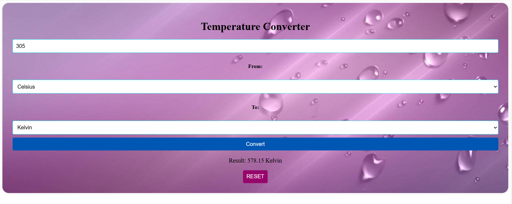

# 🌡️ Temperature Converter Website

A simple and responsive web application built with **HTML, CSS, and JavaScript** that allows users to easily convert temperatures between **Celsius, Fahrenheit, and Kelvin**.

---

## 🚀 Features
- Convert between Celsius, Fahrenheit, and Kelvin  
- Real-time conversion with instant results  
- Clean, minimal, and responsive UI  
- Lightweight project with no external frameworks  

---

## 📸 Demo Screenshot
  
*(Add a screenshot of your project here if possible)*

---

## 🛠️ Technologies Used
- **HTML5** – Structure of the webpage  
- **CSS3** – Styling and layout  
- **JavaScript (ES6)** – Logic for conversions  

---

## 📂 How to Run
1. Clone this repository:  
   ```bash
   git clone https://github.com/Akshayasrirajam/Temperature-Converter.git
